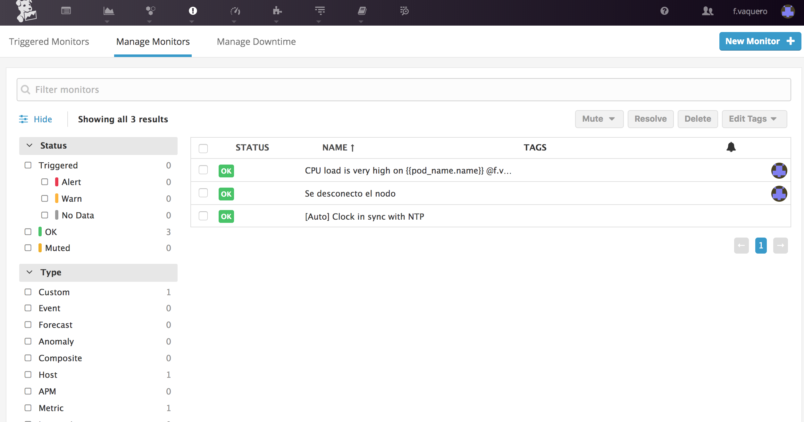

# Taller Datadog k8

El objetivo del taller es conocer la herramienta de monitoreo Datadog y su integración con la plataforma Kubernetes de la forma mas cercana posible a la infraestructura actual de datos.gob.mx.

Los temas que se cubriran son:
- Integración del agente de Kubernetes
- Creación de Metricas
- Creación de Alertas
- Creación de Dashboards

## Kubernetes Lab
Para este taller es necesario crear un cluster de Kubernetes 1.5.2 Con los siguientes nodos:
- Master
- Nodo1
- Nodo2

Para generarlo se requiere tener instalado:
- [Vagrant](https://www.vagrantup.com/downloads.html)
- [Ansible](http://docs.ansible.com/ansible/latest/installation_guide/intro_installation.html#intro-installation-guide)
- [VirtualBox](https://www.virtualbox.org/wiki/Downloads)

### Instalación de ambiente

El ambiente es autogenerado por un playbook de Ansible provisionado por Vagrant.
```sh
git clone git@github.com:vaquer/k8-ansible.git
cd k8-ansible
vagrant up
```

### Integración del Agente DD

Se debe crear el siguiente DeamonSeat en kubernetes

```yml
# dd-agent.yml
apiVersion: extensions/v1beta1
kind: DaemonSet
metadata:
  name: dd-agent
spec:
  template:
    metadata:
      labels:
        app: dd-agent
      name: dd-agent
    spec:
      containers:
      - image: datadog/docker-dd-agent:5.12.0
        imagePullPolicy: Always
        name: dd-agent
        ports:
          - containerPort: 8125
            name: dogstatsdport
            protocol: UDP
        env:
          - name: API_KEY
            value: 
          - name: KUBERNETES
            value: "yes"
          - name: SD_BACKEND
            value: docker
          - name: KUBERNETES_KUBELET_HOST
            valueFrom:
              fieldRef:
                fieldPath: spec.nodeName
        resources:
          requests:
            memory: "256Mi"
            cpu: "200m"
          limits:
            memory: "256Mi"
            cpu: "200m"
        volumeMounts:
          - name: dockersocket
            mountPath: /var/run/docker.sock
          - name: procdir
            mountPath: /host/proc
            readOnly: true
          - name: cgroups
            mountPath: /host/sys/fs/cgroup
            readOnly: true
        livenessProbe:
          exec:
            command:
            - ./probe.sh
          initialDelaySeconds: 15
          periodSeconds: 5
      volumes:
        - hostPath:
            path: /var/run/docker.sock
          name: dockersocket
        - hostPath:
            path: /proc
          name: procdir
        - hostPath:
            path: /sys/fs/cgroup
          name: cgroups
``` 

Desplegar en el cluster con `kubectl create -f dd-agent.yml`

### Creación de Metricas
La metrica de ejemplo monitorea la actividad del CPU y lanzara una alerta si el comportamiento en promedio durante 1 minuto sobrepasa un nivel definido por el usuario.


Resultado Final


### Creación de Alertas
La alerta de ejemplo revisara el estado del agente datadog en un nodo del cluster de K8, si el agente deja de transmitir datos durante 2 minutos seguidos se tomara como un problema y puede que el nodo este caido.


Resultado Final
